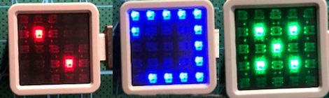

# Graphical indicator of the free power output of a solar power plant

The version communicating with NODE RED via HTTP protocol and getting information about the consumption or, on the contrary, the amount of power to be used. NODE RED returns JSON data.

The ATOM Matrix ESP32 module, which contains a matrix of RGB LEDs, was chosen as the graphic indicator. 

https://shop.m5stack.com/products/atom-matrix-esp32-development-kit

Functionality:
After pressing the display button, it switches to AP 'PowerCube' mode and the configuration UI can be displayed by connecting to the web browser IP 192.168.4.100. Here you set the SSID, password and URL from where data is retrieved, e.g. NODE RED. See the example in the nodered directory.

note:
Don't forget to upload from the `data` directory via 'Upload File System Image'

